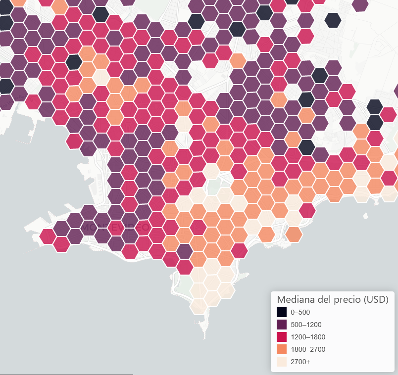

# gallito_scrap

Scrapeo de datos de [El Gallito](https://www.gallito.com.uy/inmuebles) usando Python, Selenium y BeautifulSoup.

Acceda al [web-map](https://guillermodangelo.com/webmaps/hexgrid_mvo/)

## Introducción

Requiere de instalar [ChromeDriver](https://chromedriver.chromium.org/downloads) o modificar el script para usar otro navegador.

Crear un virtual environment y instalar las dependencias con `pip install -r requirements.txt`. 

Correr el scraper con `python run_scraper.py`, una vez activado el virtual environment.

## Funcionamiento

1. Correr el scraper

Las funciones de scraping se encuentran en el archivo `scraper_gallito.py`. Para correr el scraper, ejecutar el archivo `run_scraper.py`.

Setear la variable `DEBUG` a `True` para correr el scraper en modo debug. Setear la cantidad de hilos a usar en `THREADS`.
Este script devuelve un listado de URLs de ventas, que luego se toman como entrada para el script `scrap_latlng.py`.

2. Scraping de coordenadas

Para scraping de coordenadas, ejecutar el archivo `scrap_latlng.py`. El script va recorriendo cada URL de ventas y extrayendo las coordenadas de la página, si están disponibles.

Setear la variable `DEBUG` a `True` para correr el scraper en modo debug. Setear la cantidad de hilos a usar en `THREADS`.
Cambiar el archivo `INPUT_FILE` para usar un archivo de entrada válido.

3. Postprocesamiento de datos

El archivo `coordinates_postproc.py` contiene funciones para procesar los datos scrapeados, eliminando algunos valores y formateando algunos datos.

4. Geoprocesamiento

El archivo `geoprocess.py` contiene funciones para procesar los datos scrapeados, agrupando los mismos en una grilla hexagonal y exportando a Geopackage y JSON (para ser usando en el web-map).

